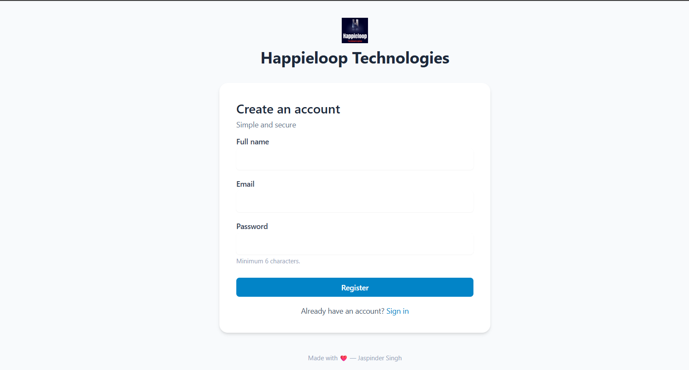

🚀 AuthForge — Secure User Authentication API

A robust, production-ready backend for modern applications

🌟 Overview

AuthForge is a secure, scalable user authentication backend built with Node.js, Express, MongoDB, and JWT. It handles user registration, login, authentication, and protected routes with best practices for security and performance.

Designed for:

🚀 Startups

📱 Mobile Apps

🌐 Web Applications

🧩 Microservices Architecture

🎯 Why This Project Exists

Authentication is the backbone of every application. AuthForge was built to provide:

✔️ Secure password storage
✔️ Token-based authentication
✔️ Cookie-based session support
✔️ Clean architecture for scalability
✔️ Developer-friendly integration

✨ Features

🔐 Secure User Registration

Input validation

Password hashing with bcrypt

Duplicate user prevention

🔑 JWT Authentication

Token generation on login

HTTP-only cookies

Authorization headers supported

🛡️ Protected Routes

Middleware-based access control

Profile route security

⚡ Performance Optimized

Minimal middleware overhead

Efficient MongoDB queries

🌍 CORS Enabled

Frontend integration ready

🧠 Architecture Overview
Client → Routes → Controllers → Middleware → MongoDB
             ↓
          JWT Auth

🛠️ Tech Stack
Technology	Purpose
Node.js	Backend runtime
Express.js	API framework
MongoDB	Database
Mongoose	ODM
JWT	Authentication
bcrypt	Password hashing
dotenv	Environment management
cookie-parser	Cookie handling
express-validator	Input validation
📂 Project Structure
backend/
│── middleware/
│   └── auth.js
│── models/
│   └── User.js
│── routes/
│   └── auth.js
│── server.js
│── package.json
│── .env

⚙️ Installation Guide
🔹 1. Clone the repository
git clone <your-repo-url>
cd backend

🔹 2. Install dependencies
npm install

🔹 3. Setup environment variables

Create .env file:

PORT=4000
MONGO_URI=your_mongodb_uri
JWT_SECRET=your_secret_key
JWT_EXPIRES_IN=1d
NODE_ENV=development

🔹 4. Run the server

Development:

npm run dev

Production:

npm start

Server runs at:

http://localhost:4000

🔗 API Endpoints
🟢 Register User

POST /api/auth/register

{
  "name": "Harry",
  "email": "harry@example.com",
  "password": "123456"
}

🔵 Login User

POST /api/auth/login

Returns JWT token

Stored in HTTP-only cookie

🔴 Logout User

POST /api/auth/logout

🟡 Get Profile (Protected)

GET /api/auth/profile

Requires:

JWT token in cookie or header

🔒 Security Highlights

✅ Password Hashing
✅ JWT Expiration Control
✅ HTTP-only Cookies
✅ Input Validation
✅ Middleware Protection
✅ Secure Production Settings

📸 Project Preview
🖥️ API Testing Example

Add your screenshot here

👉 Save your screenshot as:

/screenshot.png

🧪 Testing Tools

Postman

Thunder Client

Insomnia

🚀 Future Enhancements

🔹 Email verification

🔹 Password reset

🔹 OAuth login

🔹 Role-based access control

🔹 API rate limiting

🔹 Swagger documentation

🤝 Contributing

Pull requests are welcome!
For major changes, open an issue first to discuss ideas.

👨‍💻 Author

Harry
Backend Developer | Problem Solver | Tech Enthusiast

🍴 Fork it

🧠 Share it
